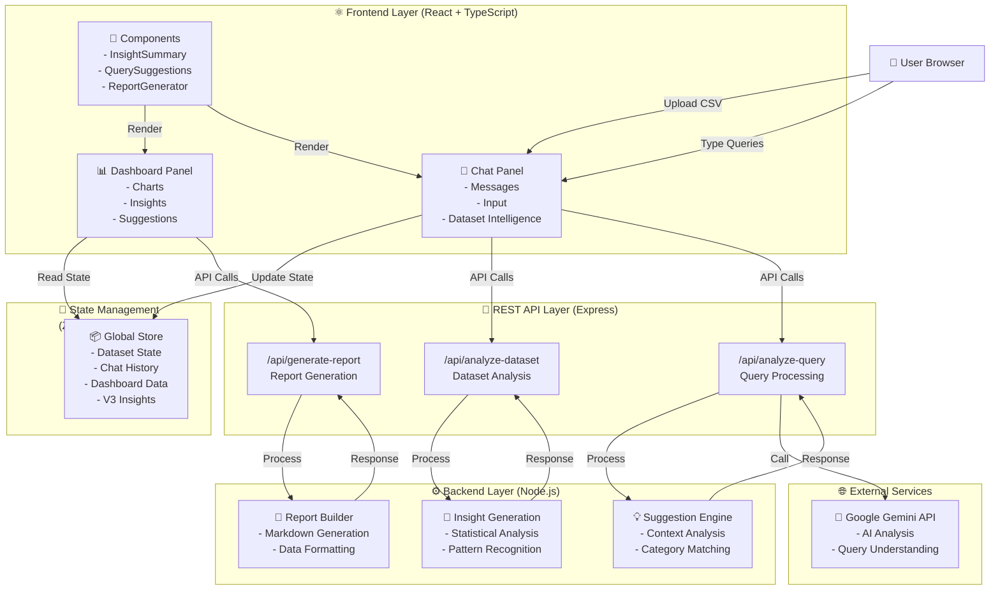
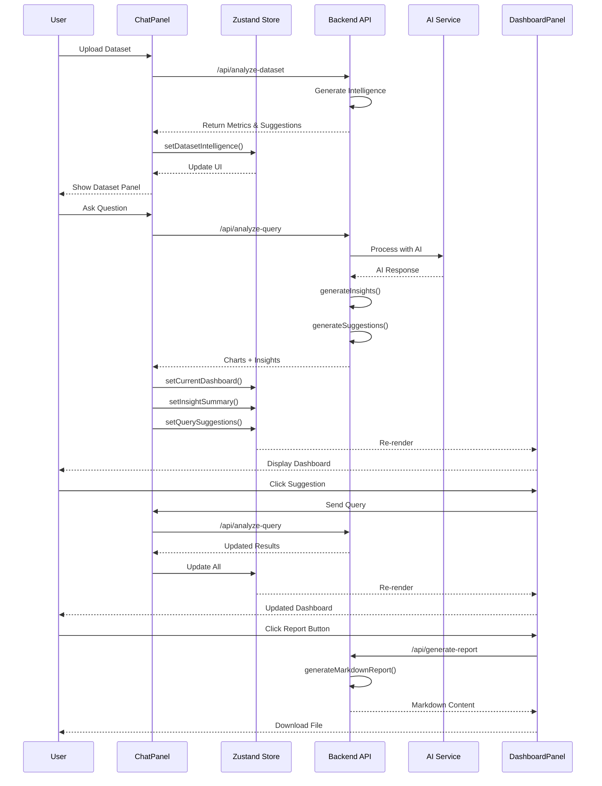
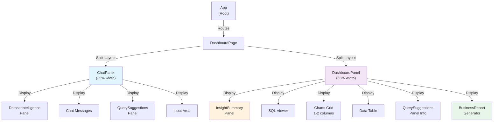
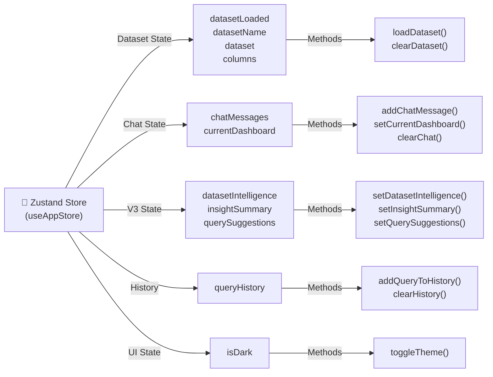

# 🚀 InsightAI V3 - AI-Powered Business Intelligence Platform


> Transform your data into actionable business insights with AI-powered conversational analytics.

InsightAI V3 is an advanced business intelligence platform that combines real-time data visualization with AI-generated insights, smart suggestions, and automated reporting to help you explore and understand your data faster.

---

## ✨ Core Features

### 🤖 Conversational Dashboard Updates
- Context-aware follow-up queries with full conversation history
- Dashboard updates intelligently without duplication
- Natural language understanding for complex requests
- **Example**: "Filter to East region" → updates existing chart dynamically

### 💡 AI Insight Summary
- Auto-generated business insights from chart data
- Three categories: Key Insights, Key Findings, Recommendations
- Statistical analysis with pattern recognition
- Color-coded visual indicators for quick scanning

### 📊 Business Report Generator
- One-click professional markdown report generation
- Includes executive summary, SQL queries, findings, data highlights
- Automatic file download with timestamp
- Share-ready format for stakeholders

### 🎯 Smart Query Suggestions
- Context-aware follow-up recommendations
- 4 categories: Comparison, Trend, Filter, Analysis
- Clickable buttons for frictionless exploration
- Dynamically generated per dashboard

### 📈 Dataset Intelligence
- Automatic analysis upon dataset upload
- Field type detection (numeric metrics & categorical dimensions)
- Smart starter questions for new users
- Interactive reference panel

---

## 🏗️ Architecture

### System Architecture


### Data Flow


### Component Hierarchy


### State Management Structure


---

## 🚀 Quick Start

### Prerequisites
- **Node.js** 18+ ([install nvm](https://github.com/nvm-sh/nvm))
- **npm** 9+
- **GEMINI_API_KEY** environment variable

### Installation

```bash
# Clone repository
git clone https://github.com/Saikirankmit/insight-ai-system.git
cd insight-ai-system

# Install dependencies
npm install

# Set environment variable
export GEMINI_API_KEY=your_key_here  # macOS/Linux
# or
set GEMINI_API_KEY=your_key_here     # Windows CMD
# or
$env:GEMINI_API_KEY="your_key_here"  # PowerShell
```

### Development

```bash
# Start dev server (client + server with hot reload)
npm run dev

# Client only: http://localhost:5000
npm run client:dev

# Server only (requires separate terminal)
npm run server:dev
```

### Production

```bash
# Build both client and server
npm run build

# Start production server
npm start
```

---

## 📖 Usage Guide

### 1. Upload Dataset
**Action**: Navigate to Datasets tab → Upload CSV file

**What Happens**:
- ✅ Dataset intelligence automatically generated
- ✅ Shows row/column counts
- ✅ Detects numeric metrics
- ✅ Detects categorical dimensions
- ✅ Provides starter questions

### 2. Ask Questions
**Action**: Click suggestion or type question in chat

**What Happens**:
- ✅ AI analyzes query with Gemini
- ✅ Dashboard generated with charts
- ✅ Insights extracted and displayed
- ✅ Follow-up suggestions generated

### 3. Follow-up Queries
**Action**: Click suggestion button or type new question

**What Happens**:
- ✅ Previous conversation maintained
- ✅ Dashboard updates intelligently
- ✅ New insights generated
- ✅ Context understood by AI

### 4. Generate Report
**Action**: Click "Generate Business Report" button

**What Happens**:
- ✅ Professional markdown report generated
- ✅ Includes all dashboard data
- ✅ File downloads automatically
- ✅ Ready to share with stakeholders

---

## 📡 API Reference

### POST `/api/analyze-dataset`
Analyzes dataset structure and generates intelligence.

**Request**:
```json
{
  "columns": [
    {"name": "revenue", "type": "number"},
    {"name": "region", "type": "string"}
  ],
  "data": [...],
  "datasetName": "sales_data"
}
```

**Response**:
```json
{
  "rowCount": 12000,
  "columnCount": 6,
  "numericMetrics": ["revenue", "quantity"],
  "categoricalFields": ["region", "category"],
  "suggestedQuestions": ["Show revenue by region", ...]
}
```

### POST `/api/analyze-query`
Analyzes user query and generates dashboard with insights.

**Request**:
```json
{
  "query": "Show revenue by region",
  "columns": [...],
  "sampleData": [...],
  "conversationHistory": [
    {"role": "user", "content": "..."},
    {"role": "assistant", "content": "..."}
  ]
}
```

**Response**:
```json
{
  "sql": "SELECT region, SUM(revenue) FROM data GROUP BY region",
  "message": "Here's your revenue breakdown...",
  "charts": [{
    "type": "bar",
    "title": "Revenue by Region",
    "data": [...],
    "keys": ["revenue"]
  }],
  "table": [...],
  "insights": ["East region leads", ...],
  "keyFindings": ["Strong variation detected", ...],
  "recommendations": ["Focus on East region", ...],
  "querySuggestions": [{
    "text": "Compare with previous quarter",
    "category": "Comparison"
  }]
}
```

### POST `/api/generate-report`
Generates professional markdown business report.

**Request**:
```json
{
  "sql": "SELECT ...",
  "charts": [...],
  "table": [...],
  "datasetName": "sales_data"
}
```

**Response**:
```json
{
  "markdown": "# Business Report\n\n...",
  "timestamp": "2026-03-10T12:34:56Z"
}
```

---

## 🛠️ Technology Stack

### Frontend
| Technology | Purpose |
|------------|---------|
| **React 18** | UI framework |
| **TypeScript** | Type safety |
| **Zustand** | State management |
| **Tailwind CSS** | Styling |
| **Shadcn UI** | Component library |
| **Framer Motion** | Animations |
| **Recharts** | Data visualization |
| **Vite** | Build tool |

### Backend
| Technology | Purpose |
|------------|---------|
| **Node.js** | Runtime |
| **Express.js** | Web framework |
| **TypeScript** | Type safety |
| **Google Gemini API** | AI analysis |

### Development
| Tool | Purpose |
|------|---------|
| **npm** | Package manager |
| **TypeScript** | Type checking |
| **ESLint** | Code linting |
| **Vite** | Dev server & bundler |

---

## 📁 Project Structure

```
insight-ai-system/
├── src/
│   ├── components/
│   │   ├── ChatPanel.tsx                 # Chat interface with suggestions
│   │   ├── DashboardPanel.tsx            # Dashboard with insights
│   │   ├── DatasetIntelligence.tsx       # Dataset analysis display
│   │   ├── InsightSummary.tsx            # Insights rendering
│   │   ├── QuerySuggestions.tsx          # Suggestions display
│   │   ├── BusinessReportGenerator.tsx   # Report download
│   │   └── ui/                           # Shadcn UI components
│   ├── pages/
│   │   ├── DashboardPage.tsx             # Main dashboard
│   │   ├── DatasetManagerPage.tsx        # Dataset upload
│   │   └── ...
│   ├── lib/
│   │   ├── store.ts                      # State management
│   │   ├── utils.ts                      # Utilities
│   │   └── mockData.ts                   # Mock data
│   ├── App.tsx
│   └── main.tsx
├── server/
│   ├── routes/
│   │   ├── analyze-dataset.ts            # Dataset analysis endpoint
│   │   ├── analyze-query.ts              # Query analysis endpoint
│   │   ├── generate-report.ts            # Report generation endpoint
│   │   └── ...
│   └── index.ts                          # Server entry point
├── package.json
├── tsconfig.json
├── vite.config.ts
└── README.md
```

---

## 🔧 Configuration

### Environment Variables

Create `.env` file in project root:

```bash
# Required: Google Gemini API Key
GEMINI_API_KEY=your_gemini_api_key_here

# Optional: Server port (default: 3000)
PORT=3000

# Optional: Environment (development/production)
NODE_ENV=development
```

### Development Configuration

**Vite Client** (`vite.config.ts`):
- Port: 5000
- Hot module replacement enabled
- Fast refresh enabled

**Express Server** (`server/index.ts`):
- Port: 3000
- CORS enabled
- JSON parsing (10MB limit)

---

## 📊 Data Flow Guide

### New User Journey
```
1. Upload CSV
   ↓
2. Dataset intelligence analyzed
   ↓
3. Suggested questions displayed
   ↓
4. User clicks suggestion
   ↓
5. Query sent to AI
   ↓
6. Dashboard generated with insights
   ↓
7. Follow-up suggestions shown
   ↓
8. User explores further
   ↓
9. Generate professional report
   ↓
10. Download and share
```

---

## ✅ Key Files Modified/Created

### New Files
- `src/components/DatasetIntelligence.tsx`
- `src/components/InsightSummary.tsx`
- `src/components/QuerySuggestions.tsx`
- `src/components/BusinessReportGenerator.tsx`
- `server/routes/analyze-dataset.ts`
- `server/routes/generate-report.ts`

### Modified Files
- `src/lib/store.ts` - Added V3 state
- `src/components/ChatPanel.tsx` - Dataset analysis integration
- `src/components/DashboardPanel.tsx` - V3 components integration
- `server/routes/analyze-query.ts` - Insight generation
- `server/index.ts` - New endpoints registration

---

## 🧪 Testing

### Build Verification
```bash
# Client build
npm run client:build

# Server build
npm run server:build

# Both builds
npm run build
```

### Testing Procedures
```bash
# Run tests
npm test

# Watch mode
npm run test:watch
```

---

## 🚢 Deployment

### Prerequisites
- Deployed Node.js server
- Environment variables set
- Database backup (if applicable)

### Build & Deploy
```bash
# Build production version
npm run build

# Start server
npm start
```

### Environment Setup
```bash
# Set production environment
export NODE_ENV=production
export GEMINI_API_KEY=your_production_key

# Start
npm start
```

---

## 📚 Documentation

- **[QUICKSTART.md](./QUICKSTART.md)** - Getting started guide
- **[V3_UPGRADE_DOCUMENTATION.md](./V3_UPGRADE_DOCUMENTATION.md)** - Technical deep dive
- **[IMPLEMENTATION_SUMMARY.md](./IMPLEMENTATION_SUMMARY.md)** - Implementation guide
- **[DEPLOYMENT_CHECKLIST.md](./DEPLOYMENT_CHECKLIST.md)** - Pre-deployment verification
- **[COMPLETION_REPORT.md](./COMPLETION_REPORT.md)** - Project status
- **[DOCUMENTATION_INDEX.md](./DOCUMENTATION_INDEX.md)** - Documentation index

---

## 🤝 Contributing

### Before You Start
1. Fork the repository
2. Create a feature branch: `git checkout -b feature/amazing-feature`
3. Make your changes
4. Test thoroughly
5. Commit: `git commit -m 'Add amazing feature'`
6. Push: `git push origin feature/amazing-feature`
7. Open a Pull Request

### Code Standards
- Use TypeScript for type safety
- Follow existing code style
- Add JSDoc comments for functions
- Test all changes locally
- Update documentation

---

## 📋 Checklist for New Features

- [ ] Code follows TypeScript best practices
- [ ] Components properly typed
- [ ] State management updated if needed
- [ ] API endpoints documented
- [ ] Tests written and passing
- [ ] No console errors or warnings
- [ ] Documentation updated
- [ ] Changes reviewed by team

---

## 🐛 Troubleshooting

### Issue: Build fails with TypeScript errors
**Solution**: Run `npm run server:build` to see detailed errors

### Issue: API returns 500 error
**Solution**: Check GEMINI_API_KEY is set and Gemini API is accessible

### Issue: Dashboard doesn't update
**Solution**: Verify conversation history is passed in request

### Issue: Port already in use
**Solution**: Change PORT environment variable or kill process on port

---

## 📄 License

MIT License - see [LICENSE](./LICENSE) file for details

---

## 👥 Support

For issues, questions, or suggestions:
1. Check [QUICKSTART.md](./QUICKSTART.md)
2. Review [V3_UPGRADE_DOCUMENTATION.md](./V3_UPGRADE_DOCUMENTATION.md)
3. Check source code comments
4. Open an issue on GitHub

---

## 🎉 Version History

| Version | Date | Status | Features |
|---------|------|--------|----------|
| 3.0.0 | 2026-03-10 | Production Ready | All V3 features |
| 2.0.0 | 2026-02-01 | Stable | Core dashboard |
| 1.0.0 | 2026-01-01 | Legacy | Initial release |

---

## ⭐ Quick Links

- 📖 [Getting Started](./QUICKSTART.md)
- 🏗️ [Architecture Guide](./V3_UPGRADE_DOCUMENTATION.md)
- 🚀 [Deployment Guide](./DEPLOYMENT_CHECKLIST.md)
- 📊 [API Reference](#-api-reference)
- 🔧 [Technology Stack](#-technology-stack)

---

<div align="center">

**[⬆ back to top](#-insightai-v3---ai-powered-business-intelligence-platform)**

Made with ❤️ by the InsightAI Team

</div>

- Edit files directly within the Codespace and commit and push your changes once you're done.

## What technologies are used for this project?

This project is built with:

- Vite
- TypeScript
- React
- shadcn-ui
- Tailwind CSS

## How can I deploy this project?

Simply open [Lovable](https://lovable.dev/projects/REPLACE_WITH_PROJECT_ID) and click on Share -> Publish.

## Can I connect a custom domain to my Lovable project?

Yes, you can!

To connect a domain, navigate to Project > Settings > Domains and click Connect Domain.

Read more here: [Setting up a custom domain](https://docs.lovable.dev/features/custom-domain#custom-domain)
